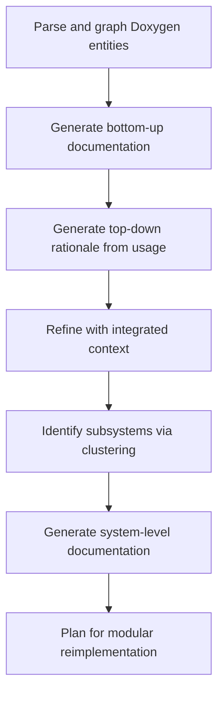

# 🧭 Project Context: Codebase Documentation and Translation

This project aims to translate a large legacy C/C++ codebase into a modern architecture (e.g., Python or modular C++), guided not by line-by-line migration but by **intent-based understanding** and **system-level redesign**. The primary objective is to preserve *what* the system does, while rethinking *how* it does it—avoiding brittle replication of legacy structure and allowing for modern, idiomatic reimplementation.

To support this, the first foundational step is **high-fidelity documentation**: an accurate, structured, and complete description of each functional entity's role, usage, and purpose.

---

## 📘 Phase 1: Entity-Level Documentation

All Doxygen-recognized entities (functions, classes, variables, enums, etc.) are extracted into a graph of dependencies and containment relationships. A multi-pass LLM-assisted pipeline is applied to generate complete documentation for each entity using the following stages:

### 1. Bottom-Up (Functional Summary)

In the first pass, documentation is generated based on how the entity *works internally*, using:
- Raw source code
- Summaries of any lower-level dependencies (functions, macros, variables, etc.)

The LLM is prompted to produce:
- `brief`: concise summary of functionality
- `details`: internal logic and behavior
- `params`, `returns`, `throws`, `tparams`: if applicable

This pass answers the question: **“What does this entity *do*?”**

---

### 2. Top-Down (Purpose Inference)

In the second pass, higher-level context is used to determine *why* an entity exists. This is inferred from:
- Concrete usage examples (e.g., calling contexts)
- Call-site patterns and descriptions

The LLM expands the documentation to include:
- `rationale`: inferred intent or role in broader workflows
- `notes`: interesting design patterns or behaviors

This pass answers: **“What is this entity *for*?”**

---

### 3. Bottom-Up Refinement (Integrated View)

In the final pass, documentation is enhanced using:
- Previously generated summaries of dependencies
- Previously extracted usage contexts
- The current draft documentation itself

This step produces polished, context-rich documentation with a complete structured format:
```json
{
  "brief": "...",
  "details": "...",
  "params": {...},
  "returns": "...",
  "throws": "...",
  "tparams": {...},
  "notes": [...],
  "rationale": "..."
}
```

This pass ensures documentation is consistent, well-informed by both low-level implementation and high-level usage, and suitable for downstream automated analysis or manual review.

---

## 🧩 Next Phase: System-Level Concept Discovery

Now that each entity has been documented in depth, the project transitions to identifying and describing *subsystems* and *high-level concepts*.

Key goals:
- Cluster documented entities into groups representing coherent systems or workflows (e.g., logging, configuration, file management)
- Understand how systems interact and depend on shared utilities
- Generate *subsystem-level summaries* suitable for guiding reimplementation

Rationale:
- Legacy codebases often entangle functionality. Subsystems must be untangled and re-expressed in terms of **purpose** rather than **file layout** or **legacy design constraints**.
- System-level documentation helps prioritize which clusters to modernize, remove, or redesign.
- These groupings provide context for later refactoring, interface design, and architectural decisions.

To support this, graph-based clustering methods like **Leiden community detection** are applied over the dependency graph. Core clusters are extracted, refined, and reviewed. Shared utility nodes (e.g., `log_error`) are handled separately to avoid distorting cluster boundaries.

These subsystems will then be documented using LLMs in a similar structured format, summarizing:
- Purpose
- Internal structure and responsibilities
- Key interfaces
- Integration points with other systems

---

## 🔄 Recap of the Pipeline



This structured, multi-stage approach ensures that both individual components and whole subsystems are captured in terms of *intent*, not just implementation—providing a sound foundation for modernizing the codebase.